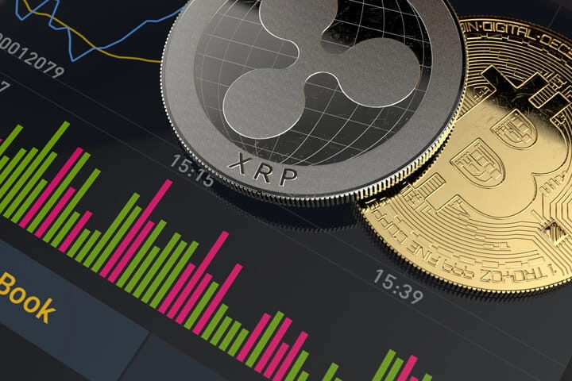
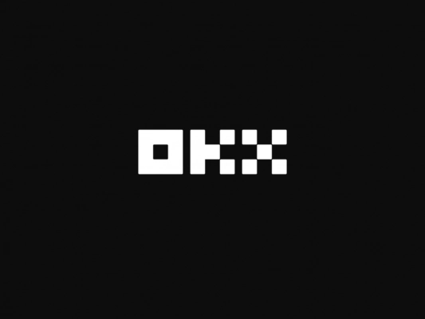
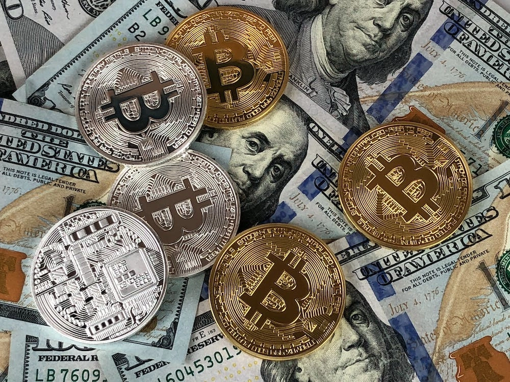
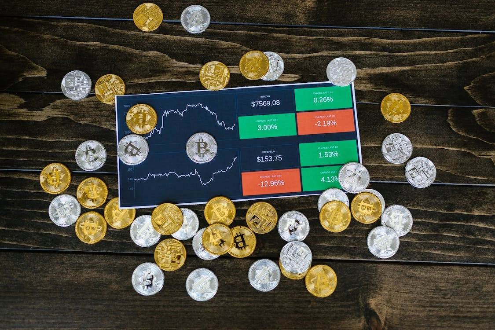
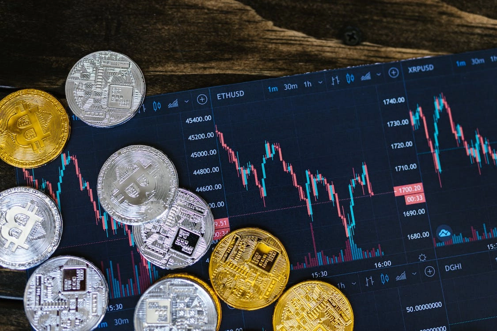

# OKX Exchange: A Comprehensive Platform Review for Crypto Traders

Cryptocurrency trading demands a reliable, feature-rich platform that balances accessibility with advanced functionality. Whether you're exploring your first Bitcoin purchase or executing complex derivative strategies, choosing the right exchange impacts everything from transaction costs to security guarantees. This review examines OKX's offerings—from its 343 tradable cryptocurrencies to its tiered fee structure—helping you determine if this top-20 platform matches your trading requirements and risk tolerance.

---

## What Makes OKX Stand Out in the Crypto Space

Launched in 2017, OKX has quietly built itself into one of the heavier hitters in cryptocurrency exchanges. Currently ranking 20th by trading volume on CoinMarketCap, the platform serves over 20 million users across 100 countries, including the Philippines.

The exchange operates in most territories worldwide, though US-based users can't access the platform due to regulatory compliance issues. If you're outside the US, you'll find a surprisingly deep ecosystem here—spot trading, margin borrowing, staking and savings programs, crypto-backed loans, and even mining pools.

What's interesting is how OKX positions itself. This isn't trying to be Coinbase's simpler cousin. The platform targets users who want more than basic buy-and-sell functionality, offering futures contracts, perpetual swaps, and options trading alongside standard spot markets.

## Platform Design: Desktop Client vs Web Interface

OKX provides both web-based trading and downloadable desktop applications. The desktop client feels noticeably smoother, especially during high-volatility periods when browser-based platforms tend to choke.

The hardware demands run higher than your typical exchange, which makes sense given the professional-grade tools packed in. The downloadable software handles memory management better, reducing those annoying freezes that pop up when you're trying to catch a price move.

For newcomers, there's a simplified conversion interface that strips away the complexity. Think of it as training wheels—you can exchange stablecoins and major cryptocurrencies without staring at order books and candlestick charts.

Advanced traders get the full trading terminal with conditional orders, stop-losses, and customizable layouts. 👉 [Ready to experience professional-grade crypto trading with competitive fees?](https://www.okx.com/join/62834398) You can tweak the interface however you want once logged in.

## The Numbers: Fees and Available Cryptocurrencies

OKX supports 343 cryptocurrencies—listing them all would fill pages. The usual suspects dominate trading volume: Bitcoin, Ethereum, and major altcoins see the most action.

The fee structure uses a tiered system based on your trading volume and OKB token holdings. Standard spot trading fees cap at 0.10%, with discounts available as you scale up. High-volume traders and OKB holders can push costs even lower.

Here's where things get murky: deposit and withdrawal fees lack transparency. The platform doesn't spell out these costs clearly, which frankly should raise eyebrows. Hidden fees aren't a great look, and OKX could do better here.

Futures, swaps, and options carry different fee schedules that vary by contract type and leverage used.

## Trading Experience: From First-Timers to Derivatives Veterans

The platform manages to serve two audiences without completely alienating either one. Beginners can fumble through their first crypto purchase without drowning in terminology. The basic interface guides you through buying Bitcoin or Ethereum step by step.

For traders who've been around the block, the advanced platform delivers. Stop orders, conditional trades, margin positions—the tools are there. The learning curve exists, but it's not punishing.

OKX's conversion form simplifies currency exchanges, especially when moving between stablecoins. Same functionality as the pro platform, just cleaner presentation. You're not hunting through menus to swap USDT for USDC.

## Security Measures and Past Incidents

As one of the larger exchanges backed by major investors, OKX maintains what you'd expect: distributed server clusters, GSLB infrastructure, and cold storage with multi-signature wallets.

In 2017, some users reported account hacks and stolen bitcoin. OKX attributed these incidents to weak user passwords and poor security practices rather than platform vulnerabilities. The exchange pushed back on claims of inadequate security, issuing stricter guidelines for account safety and wallet management.

That explanation satisfies some people and leaves others skeptical. The truth probably sits somewhere in the middle—exchanges can only do so much when users recycle passwords or skip two-factor authentication.

## Market Offerings and Trading Options

OKX handles both crypto-to-crypto and fiat-to-crypto trading, though currently only Chinese Yuan is supported for fiat transactions. Over a hundred tokens are available, with new additions rolling out regularly.

Margin trading goes up to 20:1 leverage—among the highest ratios you'll find in crypto or traditional CFD brokers. Given cryptocurrency's volatility, that leverage level gets attention. It amplifies gains and losses equally, so tread carefully.

Futures contracts come in weekly, biweekly, and monthly varieties for Bitcoin, Ethereum, and EOS. The derivatives market here runs deeper than many competing platforms.

## Account Setup and Verification Levels

Opening an OKX account follows standard exchange procedures. You'll provide basic contact information initially, but full platform access requires completing KYC (know your customer) verification.

The verification system has three levels:

**Level 1**: Basic information and ID number gets you started

**Level 2**: Third-party verification through Netverify, requiring an ID photo and selfie

**Level 3**: Accepting additional disclaimers unlocks the highest limits

Unverified accounts face withdrawal caps at 10 BTC daily and trading limits around $500 (approximately ₱29,368). Moving through verification levels expands these restrictions. 👉 [Start your crypto trading journey with flexible limits and professional tools](https://www.okx.com/join/62834398) that scale with your needs.

## The Upside

**Lower costs than most competitors**: Trading fees start at 0.10% and decrease with higher volume or OKB token stakes. Most transactions stay well under that cap.

**Staking yields that catch attention**: Some cryptocurrencies offer over 100% annual interest through staking programs. Returns vary by token and market conditions.

**Multiple deposit methods**: Bank transfers, credit/debit cards, Google Pay, and Apple Pay all work. The on-ramp flexibility beats exchanges that force you into single payment channels.

## The Downside

**No US access**: Regulatory issues keep American users locked out entirely.

**Liquidity gaps**: Despite being a top-20 exchange, some smaller cryptocurrencies show thin order books and wider spreads.  

**Customer service complaints**: Reviews paint mixed pictures, with some users reporting poor support experiences and fund recovery issues.

**Limited fiat support**: Only Chinese Yuan currently works for fiat transactions, limiting direct currency conversion options.

## Final Assessment

OKX has built a platform for traders who want more than basic spot trading. The professional-grade tools, derivatives markets, and competitive fee structure appeal to experienced investors who know what they're doing.

The lack of fee transparency on deposits and withdrawals remains a legitimate concern. Mixed customer reviews suggest support quality varies. For US residents, the platform simply isn't an option.

If you're outside the US and comfortable navigating more complex trading interfaces, OKX delivers solid infrastructure backed by substantial financial support. The 343 cryptocurrencies, staking opportunities, and advanced trading options create a comprehensive ecosystem. Just understand the verification requirements and be realistic about the learning curve if you're new to crypto. The platform rewards users who take time to understand its features—casual traders might find simpler alternatives more suitable for their needs. 👉 [Explore OKX's comprehensive trading ecosystem](https://www.okx.com/join/62834398) and discover why millions of traders worldwide choose this platform for their cryptocurrency investments.
